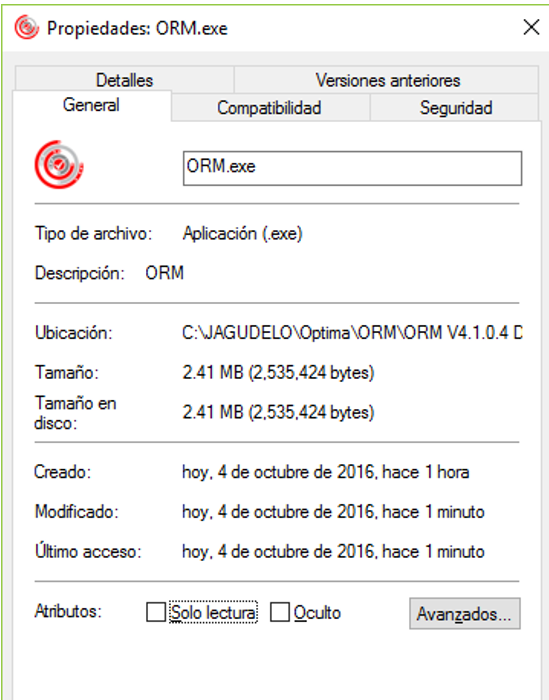
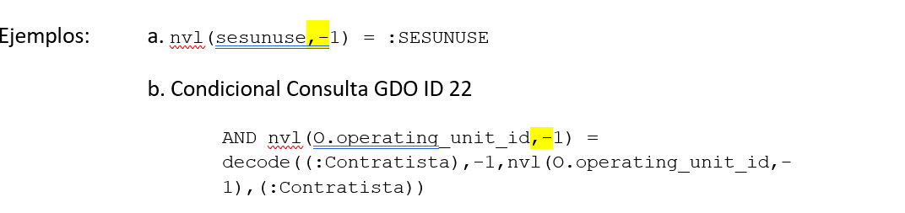

# Nota entregable ORM versión 4.1.0.4


# Notas:
En este release se crea un nuevo ejecutable con la versión 4.1.0.4, lo que indica que todos los clientes que actualmente cuenten con la versión 4.1. ... en adelante deben realizar esta actualización debido a que cubre los ajustes de bugs y novedades presentadas durante la gestión de usuarios.

# Bugs corregidos de la versión 4.1.0.3
**Nov 12 2015 - Versión 4.1.0.3:**   
•	Se ajusta manejo de parámetros de tipo variable de sustitución el cual requería que el nombre del parámetro en el query estuviera en mayúsculas para poder que el remplazo por Regex funcionara (se originó por ajuste en manejo de nombre de parámetros siempre en mayúsculas agregado en 4.1.0.2).

•	Se ajusta el manejo de la cadena de mensaje anexada al query que contiene los datos de los parámetros con los que se lanza la ejecución de la consulta, ya que si este comentario era muy largo el sistema simplemente dejaba de funcionar sin sacar mensaje. Al depurar el código se encontró que en la clase el comando o DataAdapter.Fill(oDataset); simplemente dejaba de funcionar sin que el sistema capturara la excepción. Se recorta la cantidad de información que se envía en el comentario.

**Feb 10 2016 - Versión 4.1.0.3:**

•	Se ajusta el manejo de "Guardar nuevo reporte" que no estaba funcionando cuando la consulta se encuentra almacenada en la carpeta raíz (del árbol de directorios). Se valida que esto funcionaba correctamente en versiones anteriores. Se atribuye el problema a los cambios de funcionalidades de los componentes DevExpress (en particular al TreeList).

•	Se ajusta el proceso de Drag-and-drop para consultas que se encuentren registrados en la carpeta raiz, el sistema no estaba dejando arrastrar dichas consultas para ser ubicadas en una carpeta diferente.

**Feb 11 2016 - Versión 4.1.0.3:**

•	Se ajusta el proceso de despacho de correos para que antes de lanzarlo pase la tarea de estado PENDIENTE a EN EJECUCIÓN, de esta forma si el servidor de correo se demora en enviar la respuesta de envío y el timer que recarga las tareas pendientes se cruza con esta ejecución, no se vuelve a cargar esa misma tarea y no despacha varios correos.

**Feb 24 2016 - Versión 4.1.0.3:**

•	Se ajusta validación en ```btnCambioClave_ItemClick``` (de la forma ```frmUsuarioAdmon```) para que solo aplique el desencriptado de clave si esta no viene con cadena vacía.

•	Se cambia el ```this.dsUsuarios.EnforceConstraints = false;``` en la forma para evitar error al realizar búsquedas en Administración de usuarios.

•	Se incluye el tipo 0 - Usuario APL en el combo de tipos de usuario para que dicho tipo no tenga que ser asignado por debajo (script de creación del ORM_APL)    

**Julio 12 2016 - Versión 4.1.0.3:**    
•	Al realizar una consulta con una cantidad considerable de campos y hacer uso de la pestaña “Agrupar”, no se visualizan todos los campos, debido a que se excede el tamaño disponible y no cuenta con una barra de desplazamiento vertical.
Solución: Se incluye un panel con scroll para poder desplazarse verticalmente en caso de que la cantidad de campos supere el tamaño de la pantalla. 

•	Al realizar una consulta con una cantidad considerable de campos y hacer uso de la pestaña “Ordenar”, no se visualizan todos los campos, debido a que se excede el tamaño disponible y no cuenta con una barra de desplazamiento vertical.
Solución: Se incluye un panel con scroll para poder desplazarse verticalmente en caso de que la cantidad de campos supere el tamaño de la pantalla. 

•	Al configurar una Tarea Programada en el ORM con un usuario diferente al usuario ‘ORM’, el registro de la tarea NO se visualiza en la ventana que corresponde a "Tareas Programadas” --> “Consultas programadas Activas”. El JOB se ejecuta y genera el archivo, pero NO es posible visualizar las tareas que se tienen programadas y NO permite tener control sobre el JOB que se están ejecutando. 
**Solución:** Se ajusta el package ORM_UTILS para que los jobs de ejecución de las consultas programadas sean generados en el esquema ORM y así los queries que utilizan la vista USER_JOBS puedan ver todos los jobs generados.

# Bugs corregidos para la version 4.1.0.4

**Octubre 4 2016 - Versión 4.1.0.4:**

•	Cuando se tiene configurado el Parámetro INICIAR_POST_EXEC_DISPATCHER en 'P' preguntar, cada vez que se inicia el ORM se muestra una ventana la cual pregunta si se desea abrir el Despachador de Tareas, al seleccionar la opción 'Si' , este no se abre. 
**Solución:** Se ajusta el procedimiento para que se invoque el método click del botón ```btnTareasPostEjec``` y así tener un solo código de validación de configuración SMTP y apertura de forma de tareas programadas

•	Al acceder a la pestaña de 'Administración' y seleccionar la opción "Consultas"  -->"Roles con Acceso" , se cuenta con los iconos "Refrescar, Asignar permisos, Quitar permisos", estos no funcionan y no realizan ninguna opción, ya sea que se encuentre en el modo de Editar o no.
Solución: Se ajusta el llamado a los respectivos procedimientos para refrescar, asignar y quitar permisos de una consulta

•	Al usar la opción "Abrir" se despliega la ventana donde se listan las carpetas y consultas, al cambiar una consulta de una carpeta a otra, esta se cambia de manera correcta, pero si se desea mover dentro del árbol de carpetas después de esta acción se genera un Error que indica "Error en la Conexión". La conexión esta activa, se debe cerrar la ventana y volver abrir.
Solución: Se elimina línea en la que se volvía NULL la conexión luego de actualizar el directorio de una consulta arrastrada.

•	Se detecta un escenario en el cual los parámetros definidos dentro de una consulta dejan de reconocerse por el ORM. Esta situación se presenta cuando los parámetros que estén antecedidos dentro de la misma línea por los caracteres ,-   y  estos se encuentran juntos sin ningún tipo de separador hace que NO sean reconocidos  los parámetros



**Solución:** Se ajusta el error en la clase ```StringTokenizer``` que generaba que un solo signo "-" fuera tomado como inicio de un comentario e invalidara el resto de la línea en el query. Se incluye manejo de comentarios multilíneas que no se tenían en cuenta en el ```StringTokenizer```, lo que podría generar errores en al parsear los parámetros.

# Ajustes con la versión 4.1.0.4

•	Se incluyen las funciones ```IdentifySession``` en el ```frmMain.cs``` y ```frmConsulta.cs```, con el fin de incluir la información del nombre del usuario logueado en el campo CLIENT_INFO de V$SESSION ya que un cliente requiere utilizarlo para filtrar listas de valores de parámetros en momentos de ejecución a partir de ese nombre de usuario.      

•	Se incluye también el manejo de verificar si quien está cambiando la clave de un usuario es un usuario de tipo administrador (<= 1), para que no le pida la clave actual del usuario y pueda realizar el cambio sin necesidad de conocerla..


